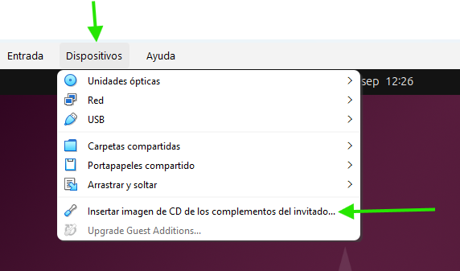

# Configuración de VirtualBox - Instalación de la Maquina Cliente

[TOC]

## 1- Configuración de Virtual Box 

Lo primero escogemos el modo *Expert*


Vamos a añadir una Red de tipo NAT para poder conectar varias máquinas virtuales


Configuramos la red:


## 2 - Creación de la nueva máquina Cliente Ubuntu

Establecemos los parámetros de la Nueva Máquina:


Podemos ver la nueva máquina:


Cambiamos algunos ajustes:

- En la **Descripción** guardamos el usuario y la contraseña de la máquina.

  

- Deshabilitamos el **Audio**:

  

- El adaptador de **Red** debe ser `Red NAT`:

  

> Configuración finalizada, ya podemos INICIAR la máquina!!

## 3- Instalación de la máquina virtual

Nos van apareciendo diferentes opciones:


## 4 - Instalación de las Guest Additions



Ejecutamos el comando:

```
sudo apt install bzip2 tar
```


Restan algunos paquetes por instalar

```
sudo apt install gcc make perl
```


Ejecutamos el programa


### **Para utilizar carpetas compartidas**

Instalamos las utilidades 

```bash
$ sudo apt install virtualbox-guest-utils
```

También ejecutamos este comando:

```bash
$ sudo usermod -aG vboxsf cliente
```

