# 01 - Ejercicio de Git - Forty - local y remoto

> Módulo: Despliegue de Aplicaciones 
>
> Web Profesora: Inés Menéndez
>
> Alumno: Cimpean Gabriel

[TOC]

## Trabajo en local

#### 1. Inicializa un nuevo repositorio Git en una carpeta llamada "`forty`" y agrega los archivos proporcionados en el aula virtual. 

#### 2. Renombra la rama master a `main`. 

#### 3. Haz que los ficheros `README.txt` , `LICENSE.txt` y `passwords.txt` sean ignorados por el control de versiones.

#### 4. Crea el archivo `passwords.txt` . Comprueba que el control de versiones lo ignora.

 

#### 5. Crea una rama llamada "`feature-content`" . Muévete a esa rama. Cambia, en la línea 3477, el `font-size` por `1.5em` en el archivo `main.css` . Confirma cambios y haz commit. Muestra los logs de la forma más gráfica posible. 

#### 6. Elimina el archivo "`passwords.txt`" en la carpeta `forty` . Verifica el estado del repositorio. ¿Hay cambios pendientes? 

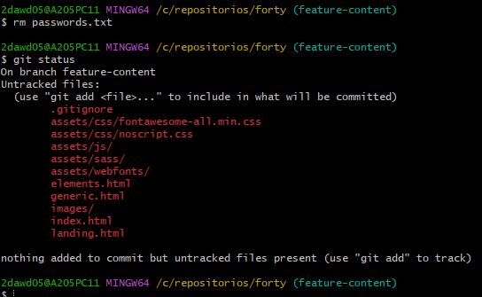

#### 7. Crea un nuevo archivo llamado " `about.html` ", partiendo del archivo `generic.html` y agrégalo al repositorio, haz un nuevo commit. 

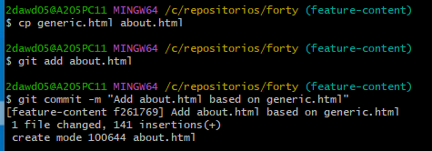

#### 8. Cambia a la rama `main` . Examina los logs del repositorio de forma gráfica. 

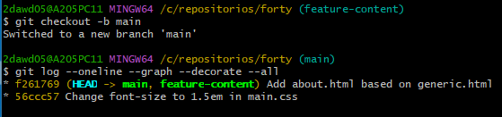

#### 9. Modifica algo en el archivo `generic.html` , comprueba que hay cambios, y realiza otro commit . Examina los logs del repositorio de forma gráfica. 

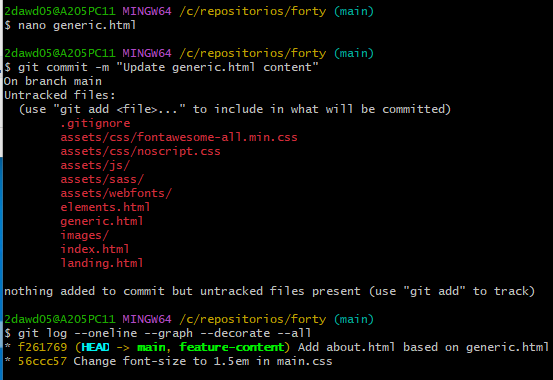

#### 10. Modifica algo en el fichero `elements.html` . Confirma los cambios, pero no hagas commit. 

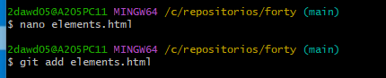

#### 11. Mira las diferencias de `elements.html` . Los cambios no nos gustan, deshaz los cambios de `elements.html` . Comprueba que no hay cambios pendientes. 

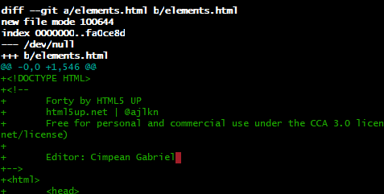

#### 12. Muestra las diferencias entre dos ramas.

 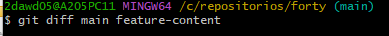

#### 13. Fusiona la rama "`feature-content`" con la rama principal (main). Muestra los logs del repositorio de una forma gráfica y completa. 

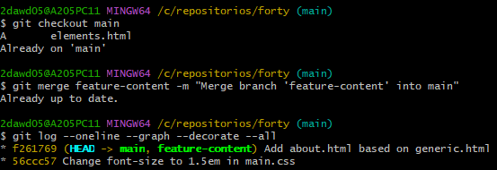

#### 14. Crea una nueva rama llamada " `hotfix` " y en ella, corrige un error crítico en el archivo " `index.html` ". (Por ejemplo, añade el enlace a la nueva página about.html) 

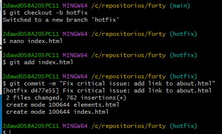

#### 15. Fusiona la rama "`hotfix`" con la rama principal y verifica el historial de commits de forma que se vean todas las ramas gráficamente. ¿Borrarías la rama `hotfix` ? ¿En qué caso? ¿Cómo? 

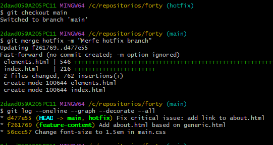

Lo borraría en caso de que no se utilice mas mediante `git branch -d hotfix`.

#### 16. Muestra el historial de cambios limitado a los últimos 3 commits. 

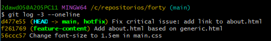

#### 17. Etiqueta el commit actual como "v1.0" y muestra las etiquetas existentes.

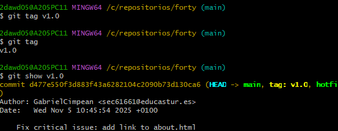

## Trabajo en remoto

#### 1. Sube al remoto los ficheros de tu repositorio local.

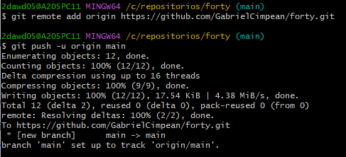

#### 2. En local, crea una rama 'feature-head'. Cambia el título en la sección head de index.html , borra los comentarios del head , o previos, también. Confirma y sube los cambios al remoto. 

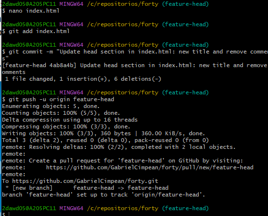

#### 3. En remoto, crea una rama 'feature-articulo'. Duplica la página generic , nómbrala como articulo.html , y añade como contenido un artículo sobre Git. Confirma los cambios y realiza un commit. Muestra los commits del repositorio tal como se ven en GitHub. 

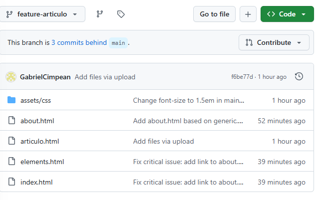

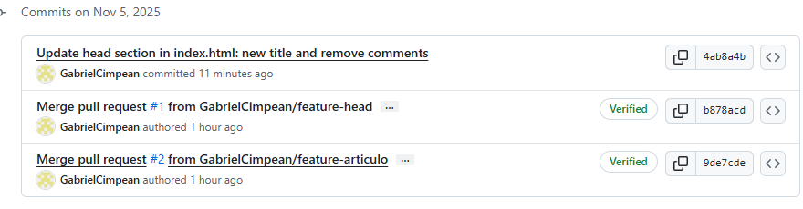

#### 4. En el repositorio local examina los cambios. Actualiza el repositorio con el remoto. Fusiona en 'main' las dos ramas 'feature'. Crea la etiqueta 'v2.0'. Muestra los logs, commits, etiquetas y ramas actuales, en local y en remoto.

#### 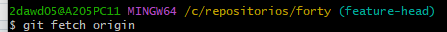 

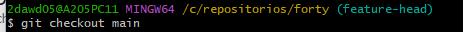

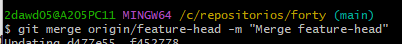

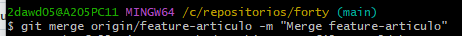

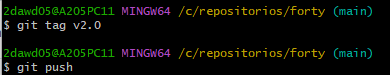

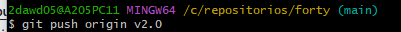

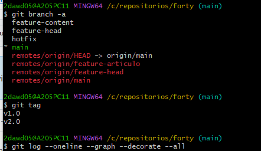

#### 5. En tu copia local, crea una rama nueva . En la rama nueva, cambia los enlaces de la página index.html para que apunten correctamente a la nueva página articulo.html . Confirma los cambios. 

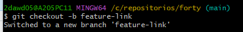

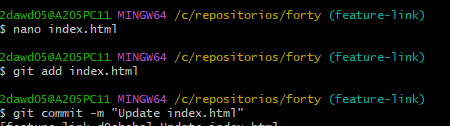

#### 6. Muestra los logs de forma que se vean las ramas en tu copia local. 

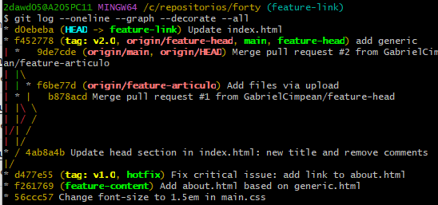

#### 7. Te gusta el resultado de los cambios. Incorpora los cambios de la rama nueva a la principal. 

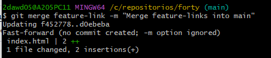

#### 8. Sube los cambios al remoto borrando la rama nueva , si es necesario. Comprueba primero con un comando en local, las ramas que hay en el repositorio remoto. 

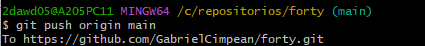

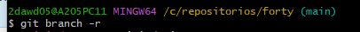

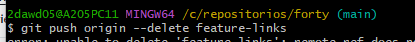

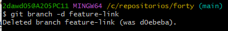

#### 9. Muestra en local los cambios en el archivo index.html entre la versión actual y la anterior. 

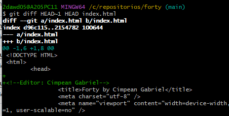

#### 10. En el repositorio en GitHub, navega hasta el archivo index.html y selecciona la opción "History".

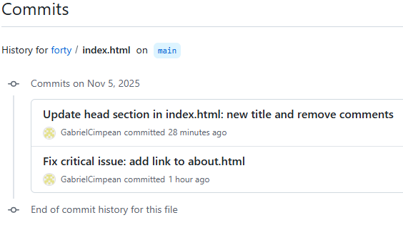