# Ejercicios Linux - capítulo 2

[TOC]


## Comandos utilizados:

- cd
- ls
- mkdir
- pwd

## Estructura de carpetas de Linux

A continuación se muestra una tabla con las direcciones mas importantes de un sistema Linux: 

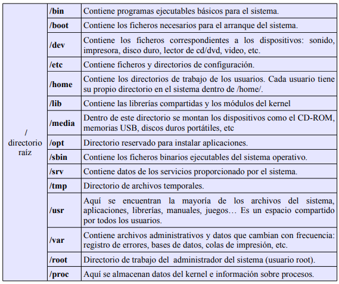

## Ejercicios

##### 1 - ¿En qué directorio se encuentran los ficheros de configuración del sistema?

​	Se encuentran en el directorio etc. `cliente@clienteUbuntu:/etc`

##### 2 - Para entrar en un sistema Linux hace falta a) nombre de usuario, contraseña y dirección IP, b) nombre de usuario y contraseña o c) únicamente una contraseña..

​	b) nombre de usuario y contraseña

##### 3 - Muestra el contenido del directorio actual

```bash
$ ls
```

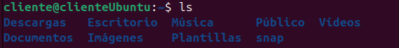

##### 4 - Muestra el contenido del directorio que está justo a un nivel superior. 

```bash
$ ls ..
```


##### 5 - ¿En qué día de la semana naciste?, utiliza la instrucción `cal` para averiguarlo

```bash
$ cal 12 1995
```

​	Con esto obtengo el mes de mi nacimiento y observo que el día 16 es 		sábado.

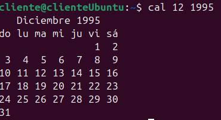

##### 6 - Muestra los archivos del directorio /bin

```bash
$ cd bin
```

​	Depende de en que lugar nos encontremos, habrá que hacer `cd ..` hasta 	llegar a la raíz (también hay otras formas) y luego ejecutar el `cd bin`.


##### 7 - Suponiendo que te encuentras en tu directorio personal (`/home/nombre`), muestra un listado del contenido de `/usr/bin` 

##### 	a) con una sola línea de comando,

```bash
$ cd /bin
```


##### 	b) moviéndote paso a paso por los directorios y 

```bash
$ cd ..
$ cd ..
$ cd bin
```

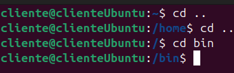

##### 	c) con dos líneas de comandos.

```bash
$ cd /
$ cd bin
```

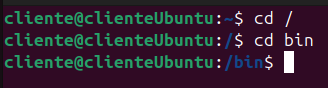

##### 8 - Muestra todos los archivos que hay en `/etc` y todos los que hay dentro de cada subdirectorio, de forma recursiva (con un solo comando).

```bash
$ ls -R /etc
```

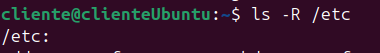

##### 9 - Muestra todos los archivos del directorio `/usr/X11R6/bin` ordenados por tamaño (de mayor a menor). Sólo debe aparecer el nombre de cada fichero, sin ninguna otra información adicional.

```bash
$ ls -S /usr/X11R6/bin
```

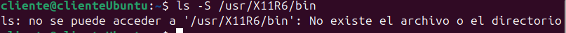

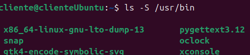

##### 10 - Muestra todos los archivos del directorio `/etc` ordenados por tamaño (de mayor a menor) junto con el resto de características, es decir, permisos, tamaño, fechas de la última modificación, etc. El tamaño de cada fichero debe aparecer en un formato “legible”, o sea, expresado en Kb, Mb, etc.

```bash
$ ls -Slh /etc
```

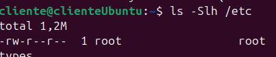

##### 11 - Muestra todos los archivos del directorio `/bin` ordenados por tamaño (de menor a mayor). Sólo debe aparecer el tamaño y el nombre de cada fichero, sin ninguna otra información adicional. El tamaño de cada fichero debe aparecer en un formato “legible”, o sea, expresado en Kb, Mb, etc.

```bash
$ ls -Sshr /bin
```

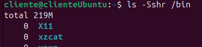

##### 12 - Muestra el contenido del directorio raíz utilizando como argumento de `ls` una ruta absoluta.

```bash
$ ls /
```

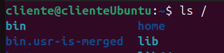

##### 13 - Muestra el contenido del directorio raíz utilizando como argumento de `ls` una ruta relativa. Suponemos que el directorio actual es `/home/elena/documentos`.

```bash
$ cd..
$ cd..
$ cd ..
$ ls
```

O

```bash
$ ls ../../..
```

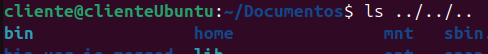

##### 14 - Crea el directorio `gastos` dentro del directorio personal.

```bash
$ mkdir gastos
```

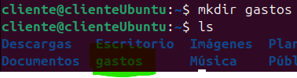

##### 15 - ¿Qué sucede si se intenta crear un directorio dentro de `/etc?`

​		Nos dice que no tenemos permisos.


##### 16 - Muestra el contenido del fichero `/etc/fstab`

```bash
$ cat /etc/fstab
```

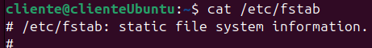

##### 17 - Muestra las 10 primeras líneas del fichero `/etc/bash.bashrc`

```bash
$ head /etc/bash.bashrc
```

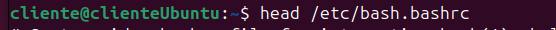

##### 18 - Crea la siguiente estructura de directorios dentro del directorio de trabajo personal:

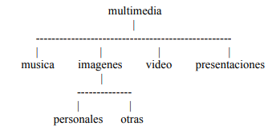

```bash
$ mkdir multimedia
$ cd multimedia
$ mkdir musica
$ mkdir imagenes
$ mkdir video
$ mkdir presentaciones
$ cd imagenes
$ mkdir personales
$ mkdir otras
```

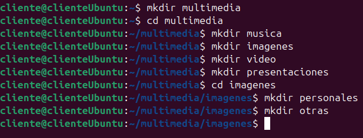

##### 19 - Crea un fichero vacío dentro del directorio `musica`, con nombre `estilos_favoritos.txt`

```bash
$ touch estilos_favoritos.txt
```

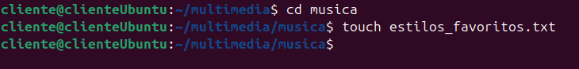

##### 20 - Utiliza tu editor preferido para abrir el fichero `estilos_favoritos.txt` e introduce los estilos de música que más te gusten. Guarda los cambios y sal.

```bash
$ vi estilos_favoritos.txt
rock
pop
rock-pop
jass
blues	
:q (para guargar)
:w (para salir)
```

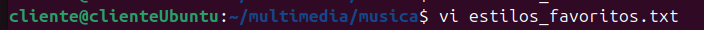

##### 21 - Muestra todo el contenido de `estilos_favoritos.txt`


##### 22 - Muestra las 3 primeras líneas de `estilos_favoritos.txt`


##### 23 - Muestra la última línea de `estilos_favoritos.txt`


##### 24 - Muestra todo el contenido del `fichero estilos_favoritos.txt` excepto la primera línea. Se supone que no sabemos de antemano el número de líneas del fichero.
